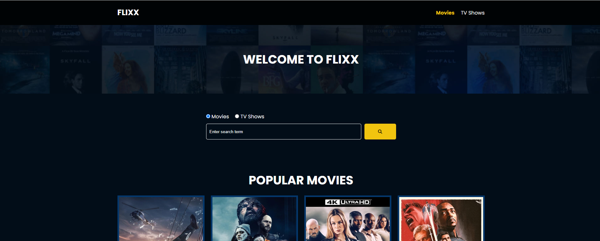

   
    
   

  

    
    
    
  

  <h3 align="center">Flixx | Movie & TV Show Application</h3>

   

     Flixx is a website which allows you to search and read more about your favorite movies and TV Shows. This project uses custom built router to showcase different data depending on which page the user is, and fetches external data from TMDB API.  
    

